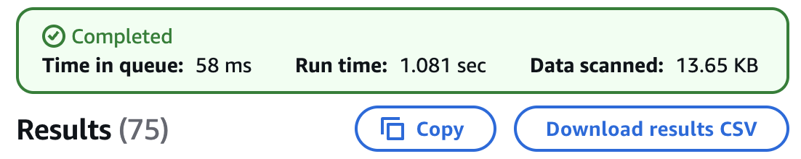

## Glue Database

We are now ready to register our datasets in the Glue Data Catalog so Athena and SageMaker can query and use them. We will create a new database in glue for our demo. Go to the console → Data Catalog → [Databases](https://console.aws.amazon.com/glue/home/v2/data-catalog/databases) → Add Database. Or simply run this cli command:

```shell
aws glue create-database --database-input '{"Name": "zebra_fish_demo"}'
```

## Ingestion: Crawlers

We will create Crawlers for:

- `observations/`
- `outcomes/`

Each crawler:

- Should point to the corresponding S3 prefix.
- Must enable date partition inference (e.g., day=2025-04-15).
- Should write to the zebra_fish_demo database.

> We will need to run the crawlers after each new upload to reflect schema changes or new partitions.

### Observation Data Crawler

Go to the console → Data Catalog → [Crawlers](https://console.aws.amazon.com/glue/home/v2/data-catalog/crawlers) → Add Crawler. Add a S3 data source: e.g. `s3://my-data-bucket/use-cases/fish-demo/observations`. In the next step let AWS create a new IAM role, e.g. `AWSGlueServiceRole-fish-demo`. Choose the earlier created `zebra_fish_demo` DB as Target database and choose to run the crawler on demand. Create the crawler and run it, this action should take about a minute to complete.

Glue will now scan our data and infer the schema. It will not copy or store the data anywhere, but only list it in the catalog. Next we will use AWS Athena to serverlessly query our data. Open the [Athena query editor](https://console.aws.amazon.com/athena/home/query-editor) → Choose AwsDataCatalog as Data Source → `zebra_fish_demo` as Database. We can then run the following SQL query.

```sql
SELECT * FROM "zebra_fish_demo"."observations" limit 10;
```

This should give you a result with 10 rows and the columns: ` fish_id` `image_id` `timestamp` `age_days` `treatment` `genetic_markers` `length_mm` `sex` `day`

### Outcomes Data Crawler

Create the crawler the same way for source `s3://my-data-bucket/use-cases/fish-demo/outcomes`. You can use the same `AWSGlueServiceRole-fish-demo` IAM role, but will need to update it's permissions to also include the `/outcomes/*` prefix. Note that the outcomes data files contain multiple json object per file whereas the observations each contain a single object. The glue crawler will still handle that fine.

Running

```sql
SELECT * FROM "zebra_fish_demo"."outcomes" limit 3;
```

will result in a table like:

| #   | fish_id     | condition_developed | day        |
| --- | ----------- | ------------------- | ---------- |
| 1   | zfish_00015 | true                | 2025-05-09 |
| 2   | zfish_00016 | false               | 2025-05-09 |
| 3   | zfish_00017 | false               | 2025-05-09 |

Here's the fully rewritten **Transformation** section of your blog article, incorporating your shift to AWS Glue ETL and addressing the critical technical decisions and justifications:

## Transformation: Rolling ETL with AWS Glue and Apache Hudi

After cataloging our structured observation and outcome data using AWS Glue Crawlers, we need to prepare a clean and efficient dataset for machine learning.

While our raw data is in JSON, machine learning workflows benefit from structured, columnar formats. We use **Apache Hudi with AWS Glue ETL** to enable transactional upserts, partitioned storage, and time travel — crucial for handling **delayed outcome data** and evolving records.

### Why We Chose AWS Glue ETL + Hudi

AWS Glue DataBrew is great for visual data prep, but lacks the flexibility needed for **rolling windows**, **delayed labels**, and **idempotent upserts**. Glue ETL Jobs using Hudi give us:

- The ability to **reprocess a time window** (e.g., last 36 days) on each run.
- **Join outcomes** as they arrive later, without duplicating existing records.
- **Efficient, incremental writes** with deduplication based on `image_id`.

### ETL Script Highlights

1. **Read the last 100 days** of `observations`.
2. **Join outcomes** via `fish_id`.
3. **Flatten** the `genetic_markers` struct.
4. **Filter** to include only labeled data (i.e., `condition_developed IS NOT NULL`).
5. **Write to Hudi**, partitioned by day.

### Why Apache Hudi?

This pipeline handles **delayed outcome data**:

- Observations are collected **daily**.
- Outcomes may only be known **weeks later**.
- We want to avoid losing observations due to missing labels initially.

Hudi enables:

- **Upserts** via `image_id` and `timestamp`.
- **Rolling window reprocessing**, so outcomes are merged when they arrive.
- **Efficient S3 writes and Athena queries** through partitioned layout.

### Key Design Decisions

#### 📆 Controlled Time Window for Simulation

We simulate time with:

```python
end_date = datetime(2025, 5, 10, 18, 0, 0)
```

This enables reproducible testing. In production, you'd use `datetime.utcnow()`.

#### 🔁 Rolling Reprocessing Window

```python
start_date = end_date - timedelta(days=50)
```

This ensures older observations can receive their outcomes during reruns. Note that 36 will be sufficient, here, but on the initial run we will need to process all the data so we will need to choose a slightly higher delta.

#### 🔗 Join with Outcomes

```python
joined = observations.join(outcomes, on="fish_id", how="left")
```

All observations are retained; outcomes are filled in when available.

We filter post-join:

```python
matched = flattened.filter("condition_developed IS NOT NULL")
```

This prepares a labeled dataset for ML use.

#### 🧬 Flatten Nested Fields

```python
.withColumn("gene_a", col("genetic_markers.gene_a"))
```

This simplifies downstream ML modeling and is also required to create the Avro schema, which hudi will do for us.

#### 📦 Hudi Write Configuration

```python
.option("hoodie.datasource.write.recordkey.field", "image_id")
.option("hoodie.datasource.write.partitionpath.field", "day")
.option("hoodie.datasource.write.precombine.field", "timestamp")
```

These ensure deterministic upserts, efficient partitioning, and deduplication. Using the `image_id` as the record key, is important, as the `fish_id` is not unique.

### 🔐 IAM Notes

Hudi performs file-level operations, so the Glue role must include `s3:DeleteObject` permissions.

Example:

```json
{
  "Effect": "Allow",
  "Action": ["s3:PutObject", "s3:GetObject", "s3:DeleteObject"],
  "Resource": ["arn:aws:s3:::your-bucket/use-cases/zfish-demo/processed/*"]
}
```

### ✅ Result

After the job runs:

- Clean Parquet data in **Hudi format**
- Partitioned by `day`
- One row per observation (`image_id`)
- Includes only labeled outcomes
- Ready for **Athena querying** or **SageMaker training**

## Running the Pipeline

Before we go on to simulate the passing of the next few days, lets have a quick revision of what we have so far. We will use Athena to query our data. The `zebra_fish_demo` database contains 3 tables: `joined_fish_data`, `observations`, `outcomes`.

The data we have uploaded (until 2025-05-10) contains 540 observations, and 20 outcomes. Querying the joined data, with

```sql
SELECT * FROM "zebra_fish_demo"."joined_fish_data";
```

60 rows are returned, that is exactly what we expect, as there are 3 observations of each fish, and we have the outcome of 20 fish. Other observations are ignored for now and will only be included in the joined set as soon as we have their outcomes.

### Simulating the next day

We can upload the next days data with:

```shell
./upload_to_s3.sh synthetic_data my-data-bucket use-cases/fish-demo 2025-05-11
```

Querying the `outcomes` with

```sql
SELECT * FROM "zebra_fish_demo"."outcomes";
```

Still results in 20 rows. This is because the database is partitioned by `day`. Due to this partitioning, the newly added data is not automatically available, but only after the new partitions have been cataloged. To do this we simply can run both of the Glue Crawlers created earlier. After running the crawlers, the query returns 25 rows.

Next we can run the Glue ETL Job. Before doing this though, we will need to updated the `end_date` variable, as that should be the current time, we assume we run the script of the evening of May 11th:

```python
# Define a rolling window (last 36 days)
end_date = datetime(2025, 5, 11, 18, 0, 0)
start_date = end_date - timedelta(days=36)
```

With 25 outcomes, we do now expect to get a total of 75 joined records in `joined_fish_data`.

```sql
SELECT * FROM "zebra_fish_demo"."joined_fish_data";
```


